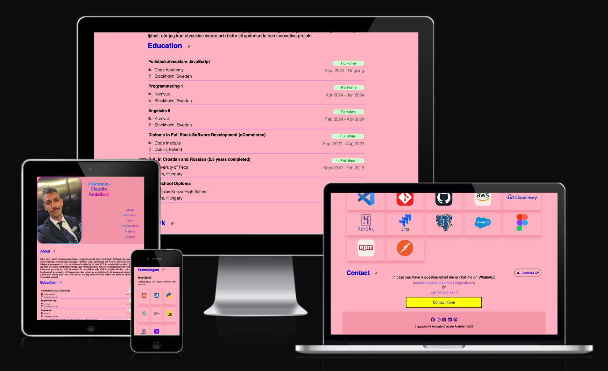
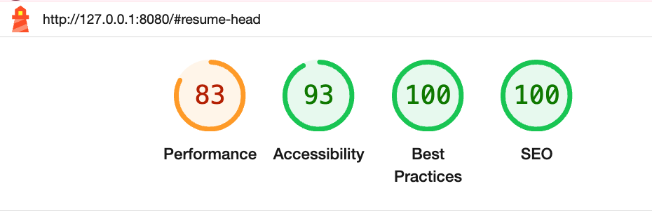
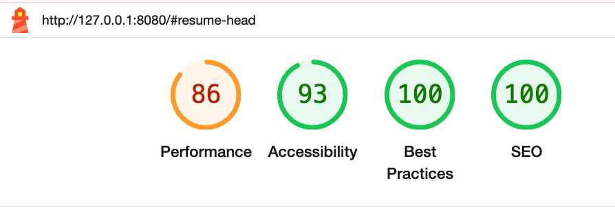
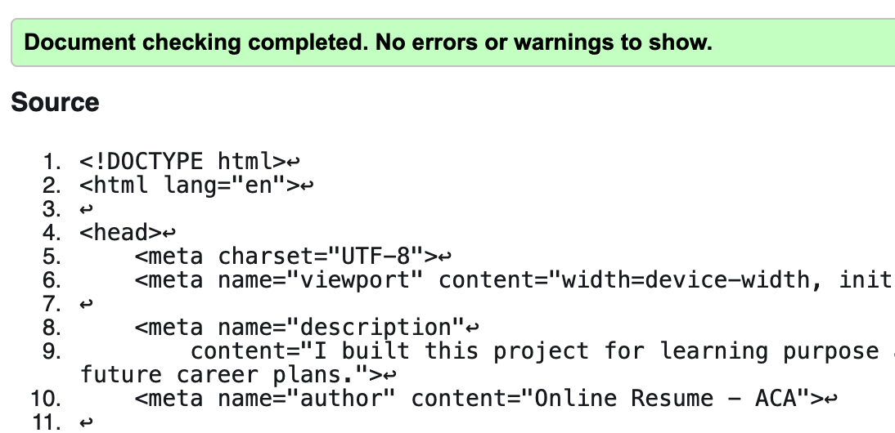
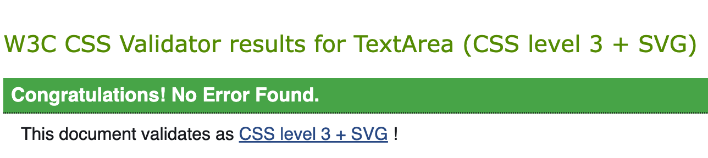

# u02- Individuell uppgift - Egen portfoliosida (HTML/CSS/JS)

## Innehållsförteckning
- [Svar på frågorna:](#svar-på-grågor)
- [u02- Individuell uppgift - Egen portfoliosida (HTML/CSS/JS)](#individuell-uppgift)
	- [Live Site](#live-site)
	- [Individual project](#individual-project)
	- [Technologies Used](#technologies-used)
    - [Responsiveness](#responsiveness)
    - [Browser Compatibility](#browser-compatibility)
    - [Lighthouse](#lighthouse)
	- [Installation](#installation)


## Svar på frågor 
- Du svarar på dessa frågor (max 800 ord):

### 1. Vad kan man utveckla m.h.a av Javascript inom frontend?

Javascript är en en av dem viktigaste programmerings språk inom den moderna webutvecklingen och är en kärnteknik inom frontendutveckling som avnänds för att skapa interaktiva och dynamiska webbapplikationer. Några exemplar på detta:

- Interaktiva webbappar som är dynamiska och användarvänliga. Exempel på det är hamburgar menyer som expanderas med en knapp, direkta formulär valideringar eller automatiserade bildgallerier.

- SPA som står för Single Page Applications skapade med olika ramverk som t.ex: React, Vue, Angular. Webbsidor som laddas på en enda sida och navigeringen i mellan olika "sidor" sker utan att sidan laddas om, som är ett stor plus för att förbättra användarupplevelse.

- Olika övergångar och animeringar. T.ex: rörelse av elementer, effekter och övergångar som förbättrar webbsidornas design.

- Realtidsapplikationer som kräver realtidsuppdateringar som live-notifikationer eller chatt tjänster. WebSockets är en teknologi som används för sådana realtidsuppdateringar.

- API Interaktion som möjliggör data hämtning och hantering från externa tjänster genom API-er. Detta spelar stor roll när det gäller dynamisk hantering av data som t.ex: väderappar eller sociala medier.

- Spelutveckling, progressiva webbappar (PWA), osv... 


#### 2. Vad är JSON och hur används det inom frontend?

JSON står för JavaScript Object Notation. Den är en enkel dataformat som är textbaserat och är lika Javascript-objekt. Den används för data representation och utbyte. Den är lätt använd inom frontendutveckling pga sin likhet till JS objekt.

- den är ett standardformat som används inom datautbyte mellan klient(frontend-app) och server via HTTP. På det sättet en webbsida kan hämta väderdata, produktinformation eller användarprofiler från en server och presentera detta på klient sidan. I så fall frontend fetchar data från externa API's som OpenWeatherMap eller Google Maps och levererar den oftast i JSON-format.

- den används också för att lagra data lokalt (localStorage eller SessionStorage).


#### 3. Vad är HTTP och varför bör man som frontendutvecklare ha kunskap om det och dess protokoll?

HTTP står för Hypertext Transfer Protocol och är en kommunikationsprotokoll som används för dataöverföring mellan klient(t.ex: webbläsare) och servrar.

- Jobba med frontend ofta betyder att man hämtar data från servrar och skickar formulärdata till backend. Utan att förstå HTTP-metoder som GET, POST, PUT och DELETE gör det nästan omöjligt om man vill interagera korrekt med API:er.

- HTTP-statuskoder och dess förståelse spelar en  jätteviktig roll inom felsökning och förbättring av applikationers funktionalitet. Exempelvis 200 OK, 404 Not Found, osv...

- Säkerhetshantering: Relaterade koncept som CORS (Cross-Origin Resource) och HTTPS (den säkra versionen av HTTP) och dess förståelse hjälper för skydda data och följa säkerhetsstandarder.

- Prestanda optimering: förståelse om HTTP/2 och caching och hur dessa fungerar är viktiga för att optimera webbapplikationernas laddningstid.

- Sessionshantering och cookies: HTTP används för sessionsdata och för att hantera autentisering, vilket spelar avgörande roll när det gäller bygga användarvänliga och säkra appar.

[Back to content list](<#innehållsförteckning>)


# Online Resume - ACA 

## Live Site

The live deployed application can be found deployed on [Github Pages](https://sandra-chas-academy.github.io/u02-individuell-uppgift-egen-portfoliosida-Balkaneros91/)).

The link to my Github repository's [Github Repo](https://github.com/sandra-chas-academy/u02-individuell-uppgift-egen-portfoliosida-Balkaneros91)).


## Individual project



Online resume project is a built on the idea of our first project for this course, the u01-individual project. It is built with HTML, CSS and I am showcasing here my latest Javascript skills. This project in compare to the first one is a single pager, which means that the future visitors has an easy overview over my online CV and the links added to every each <*h2*> and <*a*> links are connected by "href" and smooth scrool has been added to the <*html*> tag for better UX. For the "education", "work" and "projects" sections the data is fetched by using javascript from the separate JSON file. And the small size screens gets a burger menu which has been updated with addEventListener in compare to the first project in which the menu burger has been created by using the plain HTML and CSS. The resume has the "contact" section which leads to a button and when clicked modal with a contact form will be presented to the user. Since the website is an online CV I though adding the option for downloading the PDF format of it would be very cool, so I added that to the "contact" section.

[Back to content list](<#innehållsförteckning>)


## Technologies Used

### Languages Used

<ul>
<li>HTML/CSS</li>
<li>JavaScript</li>
</ul>

### Frameworks, Libraries & Programs Used

<ul>
<li>Github</li>
<li>Gitpod</li>
<li>emailJS</li>
<li>favicon.io</li>
</ul>

<hr>

### Responsiveness

I used both of these to check the responsivness across different screen sizes.

- [Am I Responsive?](http://ami.responsivedesign.is/#) 

### Browser Compatibility

| Browser       | Pass/Fail |
| ------------- | --------- |
| Google Chrome | Pass      |
| Safari        | Pass      |
| Opera         | Pass      |
| Firefox       | Pass      |

<br>

[Back to content list](<#innehållsförteckning>)

<br>


## Lighthouse
- [Lighthouse](https://developer.chrome.com/docs/lighthouse/overview/) was used to check the quality of website pages accross mobile and desktop view. 

### Lighthouse Mobile Views

<details>
<summary>Click here to see the lighthouse for mobile views:</summary>



</details>

### Lighthouse Desktop Views

<details>
<summary>Click here to see the lighthouse for desktop views:</summary>



</details> <br>

### W3C HTML Validator
- [W3C Markup Validation Serice](https://validator.w3.org/) was used to validate HTML code.
 <br>

### JIGSAW W3C CSS Validator
- [W3C CSS Validator](https://jigsaw.w3.org/css-validator/) was used to validate CSS code.
 <br>

### JShint
- [JShint Validator](https://jshint.com/) was used to validate JS code.

<br>

[Back to content list](<#innehållsförteckning>)

<br>

### Chrome DevTools
- [Chrome DevTools](https://developer.chrome.com/docs/devtools/)
    played a big role in projects development. I used it for testing, debugging. Further more for exploring around and helping myself to fix HTML and CSS difficulties with it. It help me a lot with setting the responsiveness accross different screen sizes.


## Installation
1. Klona projektet från GitHub:
   ```bash
   git clone https://github.com/username/portfolio-project.git

[Back to content list](<#innehållsförteckning>)

-----
Happy coder :)
